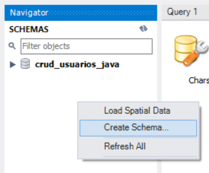
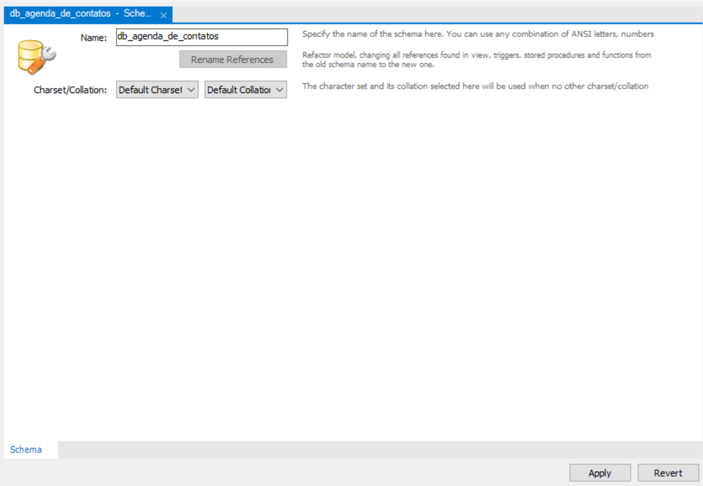
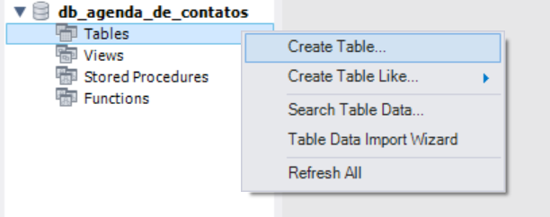
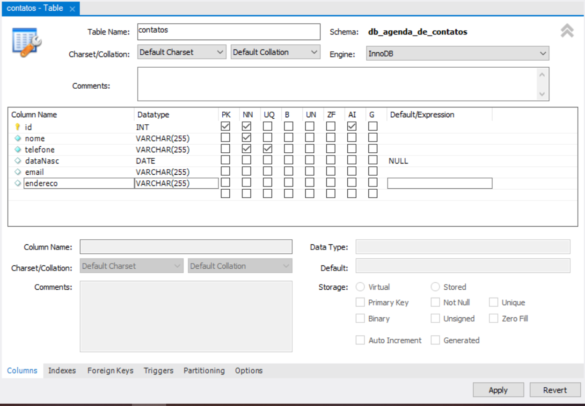

# Especificações do programa

## Banco de dados

Criar um novo banco:

- Passo 1
  

- Passo 2
   

- Passo 3: Criar a tabela: contatos

  

  Com as colunas:

  - Nome: not null
  - dataNascimento:null 
  - telefone: not null, unique
  - endereco:null
  - email:null

  

- SQL Equivalente

    ```SQL
    CREATE TABLE `db_agenda_de_contatos`.`contatos` (
      `id` INT NOT NULL AUTO_INCREMENT,
      `nome` VARCHAR(255) NOT NULL,
      `telefone` VARCHAR(255) NOT NULL,
      `dataNasc` DATE NULL DEFAULT NULL,
      `email` VARCHAR(255) NULL DEFAULT NULL,
      `endereco` VARCHAR(255) NULL DEFAULT NULL,
      PRIMARY KEY (`id`),
      UNIQUE INDEX `telefone_UNIQUE` (`telefone` ASC) VISIBLE);
    
    ```